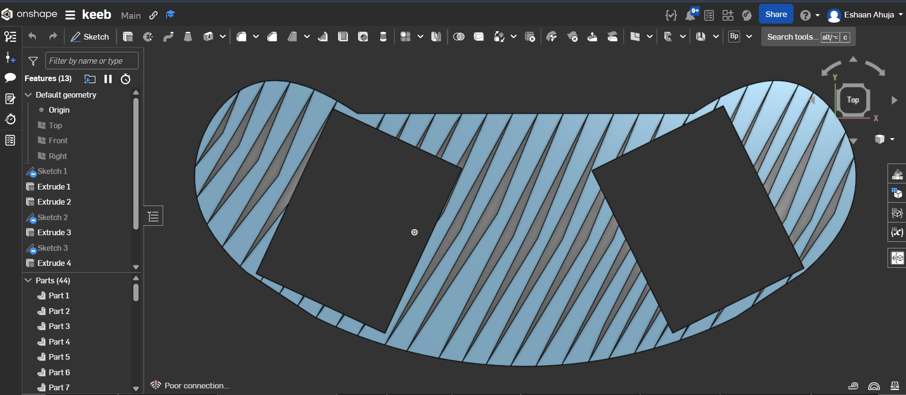
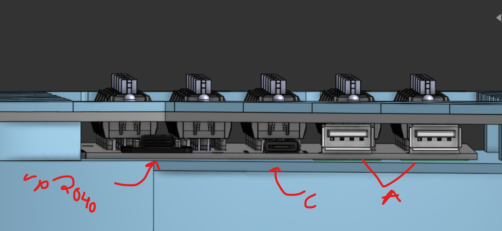

Eshaan's Split Keeb!

A seed studio rp2040 based ergonomic split keyboards to make essay writing slightly less boring! It has 50 keys (alphabet [26], numbers [10], ;,./ [4], two shifts [2], two ctrls [2], win key [1], two space keys [2], and two keys i plan to remap once the board comes in depending on what i fell like im missing), a built in USB hub, and a haptic motor!

PCB ([kicad](/keeb), [gerbers](/gerbers_final^2.zip)):

CAD ([STEP file of assembly](/final_assembly.step), [top plate](/Top%20plate.step), [bottom plate](/Bottom%20plate.step)):

Firmware [[left](/left.py), [right](/right.py)]: KMK (python), two files, one per board. Key matrix and one layer (for now, once i get the keeb i might add one more for funzies)
Aliexpress screenshot 

aliexpress screenshot with everything: 
amazon switches screenshot

All for the low price of 54.73 USD :crying emoji:

AND it has a built in USB hub for PIZZAZ

Using the USB2512_AEZG chip, I take an input of USBC and split it into two USBA ports (bc no laptop nowadays comes with USBA ports smh)

This keyboard has a 5x5 matrix on both sides, positioned at a comfortable 27 degrees so that my wrists don't cramp up while typing! It uses MX switches (the cheapest ones I could find lmao) (not hot swappable unfortunately), and 3d printed keycaps (save hack club some money lmao)

Finally, it has a built in haptic motor soldered onto the pcb to provide a better typing experience :) I couldnt find a cad model but its a really small motor that sits under the USBA ports and gets attached to the test points on the side of the seed studio

Note: switches are soldered on, I am printing the top and bottom plate, as well as the keycaps. for more info, see the [BOM](/BOM.csv)

I had a lot of fun playing with splines etc whilst doing this project! Thanks hack club for the opportunity
